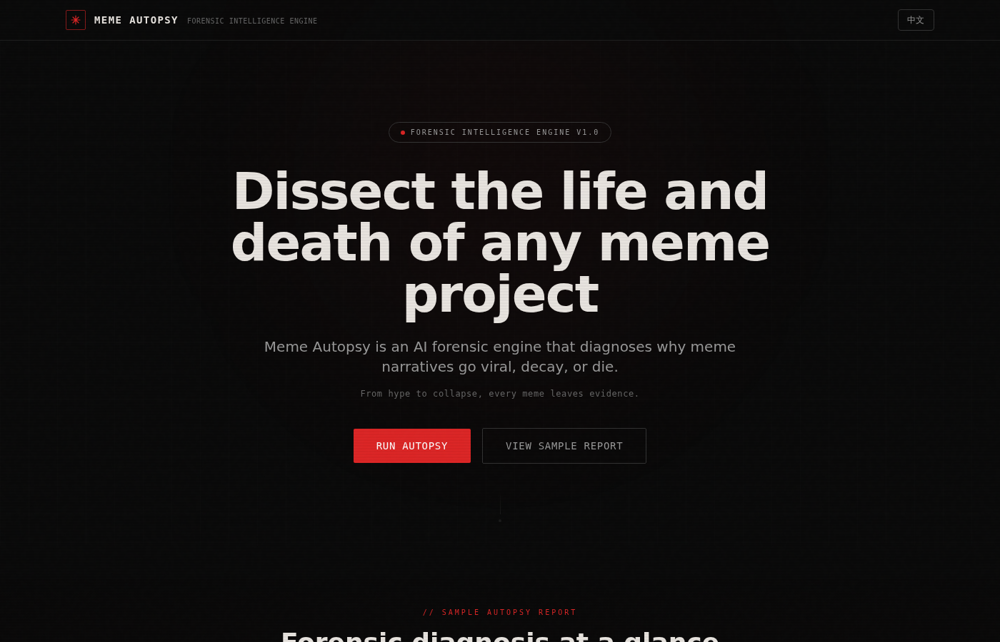
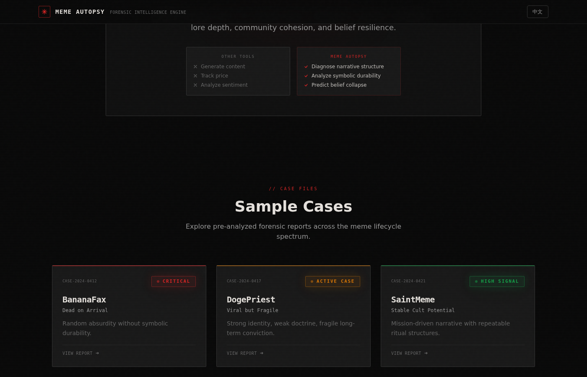
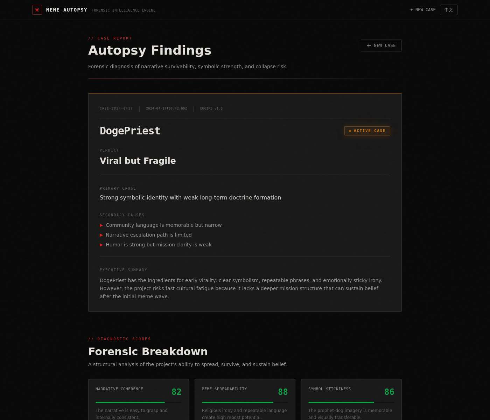

# Meme Autopsy

**AI forensic engine for meme projects**

Meme Autopsy diagnoses why meme narratives go viral, decay, or die.

**Live Demo:** [https://q5nx2y93.mule.page](https://q5nx2y93.mule.page/)







## Why it matters

Most meme tools focus on creation, hype, or surface-level sentiment. Meme Autopsy takes a different angle: it analyzes symbolic durability, lore depth, community cohesion, and belief resilience to explain why a meme project survives, fractures, or collapses.

## Why it's innovative

Meme Autopsy reframes meme analysis as forensic diagnosis rather than generation. Instead of helping users make memes, it helps them understand structural strengths, narrative weaknesses, and collapse signals through a case-report interface that feels immediate, visual, and productized.

## How the analysis works

1. **Input** — Submit a meme project's name, narrative description, community language, and source context
2. **Analyze** — The system scans symbolic patterns, narrative integrity, community signals, and belief collapse risk
3. **Report** — Get a structured forensic report with verdict, 6-dimension scoring, collapse timeline, and intervention recommendations

## Features

- Forensic case-file UI with dark cinematic aesthetic
- Verdict classification (Dead on Arrival / Viral but Fragile / Stable Cult Potential / Decaying Fast)
- Six-factor forensic scoring (0-100) with animated progress bars
- Collapse timeline with risk-tagged phases
- Intervention recommendations
- Forensic notes (strongest symbol, missing layer, community pattern, core weakness)
- CASE ID and analysis timestamps for report realism
- Demo-ready sample cases (DogePriest, BananaFax, SaintMeme)
- Chinese / English language switching
- Responsive design

## Forensic dimensions

| Dimension | What it measures |
|-----------|-----------------|
| Narrative Coherence | Internal logic and clarity of the project's story |
| Meme Spreadability | Repost potential and shareability of language |
| Symbol Stickiness | How memorable and transferable the core imagery is |
| Community Trust | Depth of belonging and identity formation |
| Lore Depth | Richness of mythology and narrative layers |
| Attention Resilience | Ability to sustain interest beyond the initial wave |

## Tech stack

- Next.js 14 (App Router)
- TypeScript
- Tailwind CSS
- React Context for i18n
- Mock analysis pipeline (designed for future LLM integration)

## Getting started

```bash
npm install
npm run dev
```

## Demo flow

1. Open the landing page
2. View the sample autopsy preview (DogePriest)
3. Explore the "How it works" and positioning sections
4. Load a sample case or enter a custom meme project
5. Run the autopsy and watch the forensic loading sequence
6. Review the verdict, root cause, and forensic breakdown
7. Explore the collapse timeline and intervention suggestions
8. Switch between English and Chinese

## Project thesis

Most meme tools help create narratives. Meme Autopsy helps explain why narratives fail.

## License

MIT
